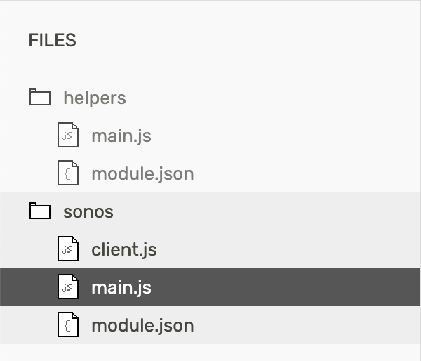

# Flick Hub SDK Scripts

Collection of [Flic Hub SDK](https://hubsdk.flic.io/static/tutorial/) scripts.

## Packages

- **helpers** provides a collection of helpers for building packages
- **sonos** provides extended home theatre control

## Usage

All packages found in this repository are configured using the helpers package. You must first create this package on your hub before adding others.



### Configuration

Each package supports basic configuration by supplying query string parameters.

```
sdk://<package-name>?configValue=1&configValue=2
```

